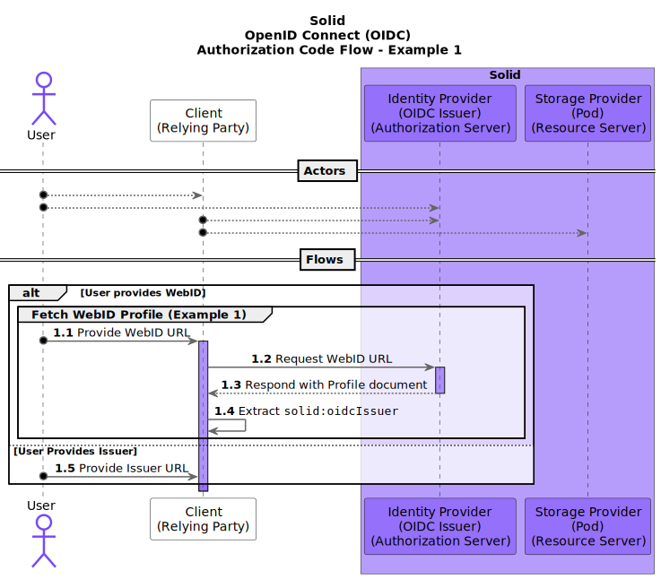
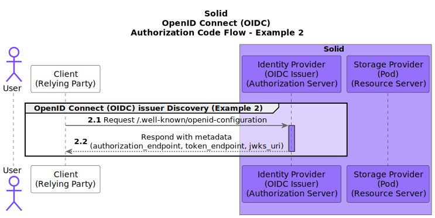
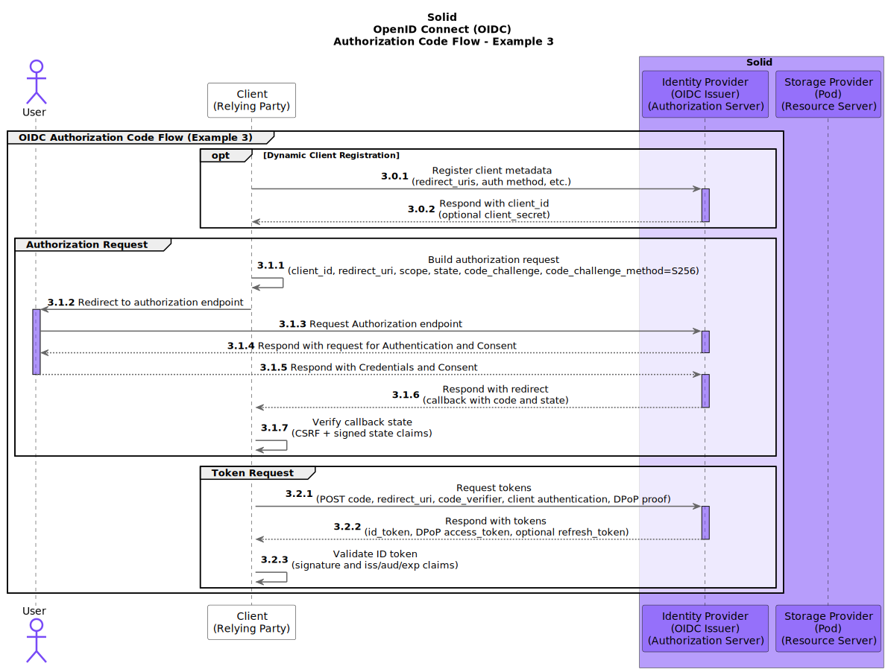
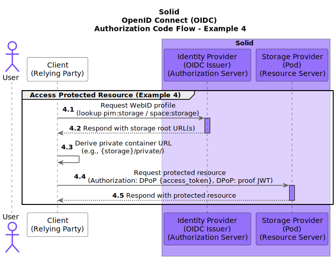
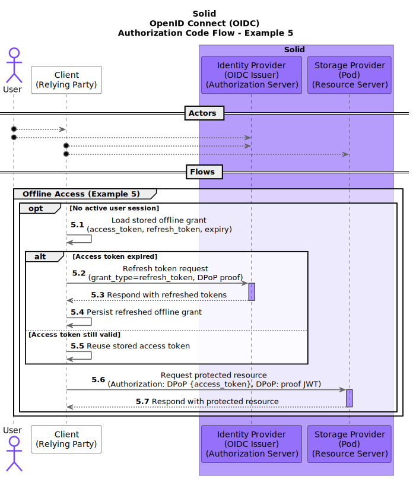
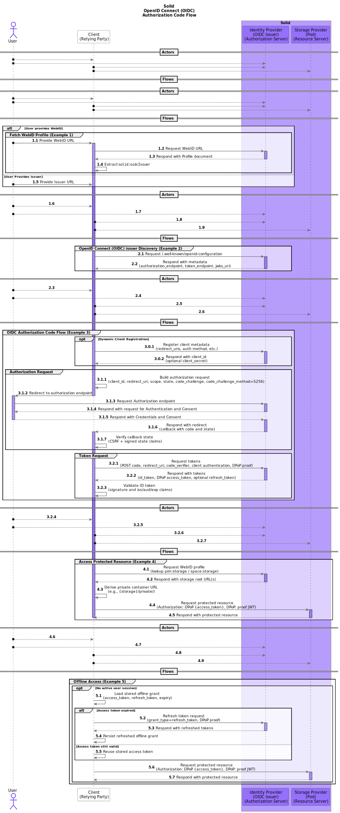

# Solid OIDC Client Examples

This project provides various examples related to accessing a protected resource on a [Solid Pod](https://solidproject.org/get_a_pod).

This includes examples of:

1. Fetching a WebID Profile
2. OpenID Connect (OIDC) Issuer Discovery
3. OIDC Authorization Code Flow
4. Accessing a protected resource
5. Accessing a private resource without an online user

## Full Flow

The full flow is:

1. ### Fetching a WebID Profile
   - The User provides the Client (the "Relying Party") with a [WebID](https://w3c-cg.github.io/WebID/spec/identity/) URL.
   - The Client fetches the [WebID Profile](https://solid.github.io/webid-profile/) from the provided URL.

   

2. ### OpenID Connect (OIDC) Issuer Discovery
   - The Client extracts the OIDC Issuer URL (`http://www.w3.org/ns/solid/terms#oidcIssuer`) from the fetched WebID Profile.
   - The Client fetches the [configuration of the OpenID Provider (the "Authorization Server")](https://openid.net/specs/openid-connect-discovery-1_0.html) from the discovery URL (`/.well-known/openid-configuration`) of the extracted OIDC Issuer URL.

   

3. ### OIDC Authorization Code Flow
   - The Client prepares an [(Authorization Code Grant) Authentication Request](https://www.rfc-editor.org/rfc/rfc6749.html#section-4.1.1) using the OpenID Provider's metadata from the fetched configuration.
   - The Client includes a signed `state` value (for CSRF protection) and PKCE (`code_challenge` and `code_challenge_method=S256`) in the authorization request.
   - The Client sends the User to the OpenID Provider, using the prepared Authentication Request.
   - The OpenID Provider [asks the User to authenticate and provide consent](https://openid.net/specs/openid-connect-core-1_0.html#Consent) for the Client to access (data on) their Solid Pod.
   - The OpenID Provider redirects the User back to a URL on the Client (the "callback" URL), with an [Authorization Code](https://www.rfc-editor.org/rfc/rfc6749.html#section-1.3.1).
   - The Client validates the returned `state` and exchanges the Authorization Code at the token endpoint using client authentication, PKCE `code_verifier`, and a DPoP proof.
   - The Client makes a request to the OpenID Provider's Token Endpoint (as described by the fetched OpenID Provider metadata) using the Authorization Code received in the callback.
   - The OpenID Provider responds to the Client with an [ID Token](https://openid.net/specs/openid-connect-core-1_0.html#IDToken), an [Access Token](https://www.rfc-editor.org/rfc/rfc6749.html#section-1.4), and (optionally) a [Refresh Token](https://www.rfc-editor.org/rfc/rfc6749.html#section-1.5).
   - The Client [validates the received ID token](https://openid.net/specs/openid-connect-core-1_0.html#IDTokenValidation) and extracts the End-User's "Subject Identifier" (the identifier of the User at the OpenID Provider, usually the WebID).

   

4. ### Accessing a protected resource
   - The Client reads the authenticated WebID profile and determines the Pod storage location (for example `pim:storage` or `space:storage`), then derives a protected container URL (for example `/private/`).
   - The Client uses the DPoP-bound Access Token to request a protected Solid resource using `Authorization: DPoP <access_token>` and a `DPoP` proof header.

   

5. ### Accessing a private resource without an online user
   - After initial consent, the Client stores an offline grant (access token, refresh token, and expiry) for a given issuer and WebID.
   - When no user session is active, the Client reuses a still-valid access token or refreshes it with the refresh token at the token endpoint (with DPoP proof).
   - The Client can then fetch the protected Solid resource without an interactive login.

   

## Full Diagram

Click to toggle full diagram

